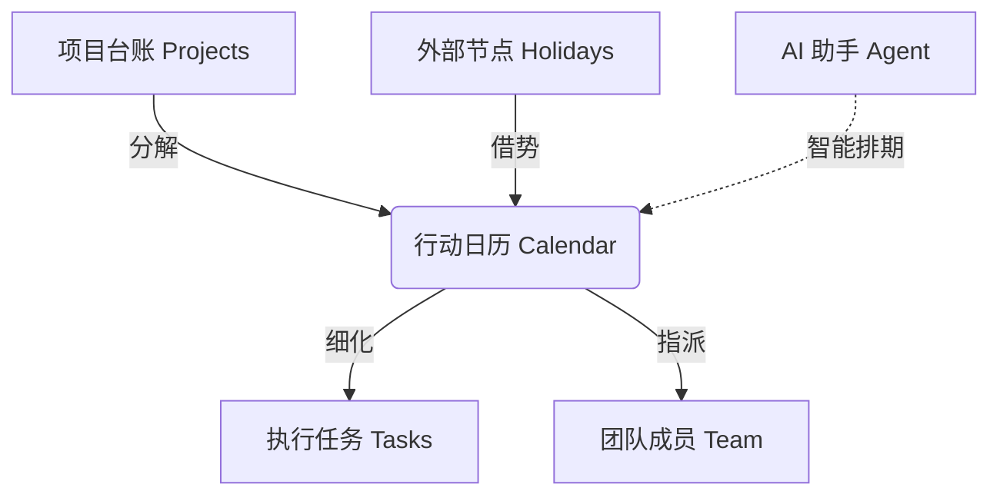

# 首页“行动日历”模块深度分析与升级方案

## 1. 核心价值与功能研判

### 1.1 功能价值定位
**“行动日历” (Action Calendar)** 不仅仅是一个时间查看工具，它是整个 NGO Planner 系统的 **“战略指挥中枢”**。
*   **战略落地锚点**：它将抽象的“项目（Projects）”和“目标（Goals）”转化为具体可执行的时间节点，是战略落地的第一公里。
*   **资源调度罗盘**：通过可视化呈现，直观反映团队在特定时间段的负荷（Busyness）和重心，帮助管理者进行人力资源的动态调配。
*   **行动触发器**：区别于普通日历，它强调“行动（Action）”，每个节点都应是可点击、可执行、可联动的任务入口。

### 1.2 解决的核心问题
*   **“做什么与何时做”的脱节**：解决项目规划（Project Manager）与日常执行（Daily Execution）分离的问题，将死板的计划表变成动态的日程。
*   **多线并行冲突**：NGO 往往多项目并行，日历通过颜色和分类（如 `CATEGORY_COLORS`）解决多任务并行的视觉混淆，预警时间冲突。
*   **外部节点对齐**：整合“节气/节日/纪念日”（Lunar/Holidays），解决公益活动往往需借势营销的痛点（当前已包含农历支持）。

### 1.3 业务衔接关系（可视化呈现）
当前架构中，日历处于业务流的核心：

*   **上游**：承接 `ProjectManager` 的里程碑规划。
*   **下游**：输出给 `UpcomingPanel`（每日待办）和 `MasterTaskBoard`（看板执行）。
*   **侧翼**：与 `TimelinePanel`（甘特图）互为表里，日历看“点”，甘特图看“线”。

---

## 2. AI 原生视角的反思与升级方向

当前 `Calendar.tsx` 功能相对传统（展示+增删改），而 AI 能力主要集中在右侧 `TimelinePanel` 的 `AIScheduleManager` 中。**真正的 AI Native 日历应从“记录工具”进化为“决策伙伴”。**

### 2.1 升级方向：从“被动查询”到“主动预判”
*   **智能空档探测 (Smart Slotting)**：
    *   *当前*：用户手动选日期添加。
    *   *升级*：AI 根据团队忙闲热力图，主动推荐“最佳执行窗口”。例如：“下周三下午全员空闲，适合安排项目复盘”。
*   **上下文感知的节点 (Context-Aware Events)**：
    *   *当前*：节点仅显示标题/分类。
    *   *升级*：节点具备“意识”。鼠标悬停时，AI 自动摘要该节点的关联文档、前序任务完成度和风险提示（如：“该活动物料尚未入库”）。
*   **动态排期模拟 (Dynamic Simulation)**：
    *   *当前*：静态展示。
    *   *升级*：在日历上直接拖拽节点时，AI 实时计算推演：“如果将此活动延后三天，将导致后续 2 个任务逾期，建议同步调整...”。

---

## 3. 首页 UI/UX 极致体验升级清单

为了将首页打造为极致的“公益人工作台”，建议进行以下交互升级：

### 3.1 视觉层：呼吸感与信息密度
*   **任务热力图背景 (Heatmap Backdrop)**：在日历日期的背景中引入微弱的色阶（Heatmap），直观展示当天的任务密度，一眼识别“忙碌日”与“空闲日”，无需逐个查看。
*   **无缝滚动视图 (Infinite Scroll)**：打破 `Prev/Next Month` 的分页限制，采用现代化的无缝纵向或横向滚动，方便查看跨月项目（如 1 月底到 2 月初的连续活动）。

### 3.2 交互层：流畅的操作流 (Flow)
*   **直接拖拽编排 (Drag & Drop Rescheduling)**：**[高优先级]** 支持直接拖拽日历上的 Event 到其他日期进行改期，松手即存，极大提升排期调整效率。
*   **右键智能菜单 (Smart Context Menu)**：右键点击日期，不仅是“新建”，而是出现 AI 建议：“在此日生成 [项目A] 的复盘会”、“基于上周进度安排跟进”。

### 3.3 结构层：所见即所得
*   **内联快速编辑 (Inline Editing)**：点击日历上的任务标题直接变为输入框进行修改，无需弹出沉重的 `Modal`，保持心流不被打断。
*   **双屏联动 (Split View Sync)**：当点击日历上的某个日期时，右侧的 `UpcomingPanel` 和 `Timeline` 应自动滚动锚定到该日期，实现左右视图的视觉同步。

## 4. 执行计划 (Next Steps)

如果您认可上述分析，我建议优先从以下两点着手落地：
1.  **实现 Drag & Drop 交互**：让日历动起来，支持拖拽改期。
2.  **植入任务热力图**：优化 `renderDays` 逻辑，增加基于任务密度的背景渲染。
